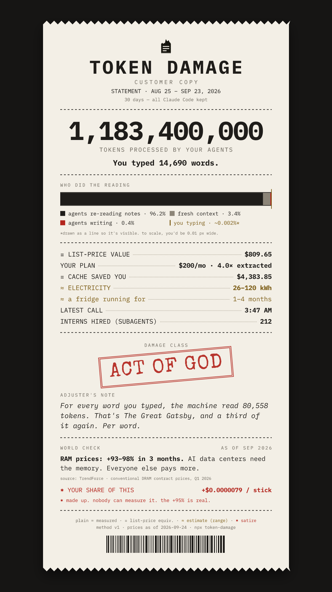

<p align="center"></p>

<h1 align="center">Token Damage</h1>

<p align="center">The receipt your AI agent never gave you. 🧾</p>

<p align="center"><a href="https://tokendamage.com">tokendamage.com</a></p>

```
npx token-damage
```

You typed a paragraph. It read a library.

Token Damage reads the logs Claude Code, Codex, Gemini CLI and OpenCode keep on your machine and prints an itemized receipt: the words you typed, the tokens your agents read, what that would cost at API list price, an electricity estimate, and a note from a tired insurance adjuster. Nothing leaves your computer.

<p align="center"></p>

## Watch it live

```
npx token-damage live
```

A calm pane to keep next to your agent. The top rows are today; the one that counts up is the prompt running right now.

```
 WATER DAMAGE   next STRUCTURAL at 100M ······ 38%
 today   1,212 words → 38.2M read          ≡ $41.20
 now     claude+3 · 4 words → 9.8M ▸        ≡ $7.10
 rate    1.4M/min ▁▂▃▅█▇▅▃▂▁   ● printing
 ─────────────────────────────────────────────────
 time   agent       you typed → it read       list
 13:41  claude      12 words →   3.1M      ≡ $2.40
 13:52  codex       31 words → 410.0K      ≡ $0.31
 ✶ four words in. a library out. the usual.
```

`q` quits. `--json` streams snapshots as JSON lines instead, for tmux bars and scripts.

To see the same numbers in Claude Code's own status line, install it once and run the setup. It shows the `settings.json` change and asks before writing:

```
npm i -g token-damage
token-damage statusline --install
```

```
▸ 4 words → 9.8M read ≡ $7.10 · +3 interns · ctx 41%
WATER DAMAGE · today 38.2M ≡ $41.20 · 5h 58% resets 16:00 · 7d 21%
```

## Receipt options

```
--plan 200     your monthly plan in USD, for "value extracted: 4.0× your plan"
--since 30d    how far back to look, or a start date (YYYY-MM-DD)
--json         the whole receipt as JSON
--no-anim      print it all at once
```

`npx token-damage --help` lists the rest. Needs Node 22 or newer (22.13 or newer to read OpenCode).

## Privacy

It reads Claude Code's transcripts and retention setting, Codex's session logs, Gemini CLI's chats and OpenCode's message database (read-only), and nothing else. Your prompts are counted, never stored. It makes no network calls and has no telemetry or accounts. The live view keeps one file, `~/.token-damage/today.json`, with numbers and hashed file names only. A share link keeps its numbers after the `#`, the part of a URL browsers never send to a server. More at [tokendamage.com/privacy](https://tokendamage.com/privacy).

## How the numbers work

Daily token totals match [ccusage](https://github.com/ryoppippi/ccusage) on the logs we've tested, and the live view's totals match the receipt's. Prices come from Anthropic's, OpenAI's and Google's public price lists, and every receipt prints the date they were checked. Electricity is always a range, because nobody publishes the real figure. Satire is printed in red and says so. The method is at [tokendamage.com/method](https://tokendamage.com/method); the details are in [docs/METRICS.md](docs/METRICS.md), [docs/DATA-SOURCES.md](docs/DATA-SOURCES.md) and [docs/LIVE.md](docs/LIVE.md).

## Development

```
pnpm i
pnpm check
```

MIT. Not affiliated with Anthropic. No refunds: tokens cannot be un-read.
